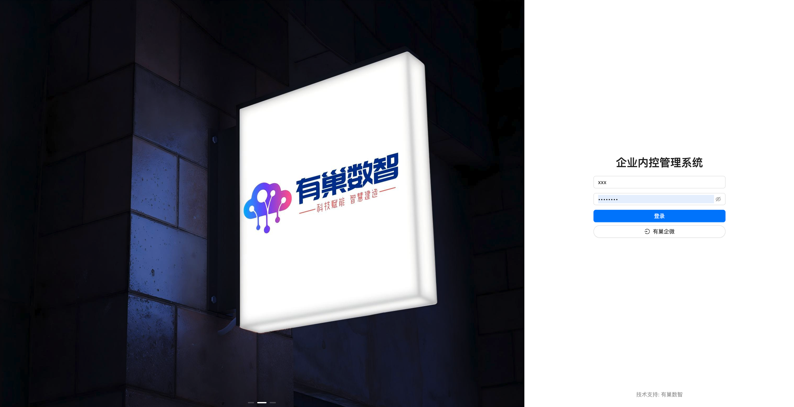
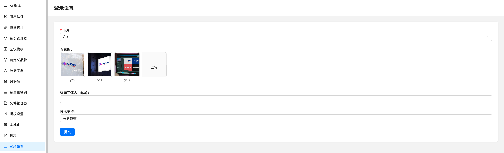

# NocoBase 登录设置插件

[English](./README.en-US.md) | 简体中文

`@youchaoyun/plugin-login-settings` 是一款用于定制 NocoBase 登录页的插件。它可以配置登录页布局、背景图轮播、标题字号和底部技术支持文案。

## 功能特性

- **三种登录页布局**
  - 默认布局：保留简洁的 NocoBase 登录页结构。
  - 居中布局：支持全屏背景图轮播，并将登录表单置于页面中部。
  - 左右布局：左侧展示背景图轮播，右侧展示登录表单；窄屏下会自动切换为上下布局。
- **背景图上传与轮播**
  - 支持上传多张背景图。
  - 在居中布局、左右布局中自动以轮播方式展示。
- **系统标题字号设置**
  - 允许单独配置登录页标题字号。
- **技术支持文案设置**
  - 可配置登录页底部的技术支持文字。
- **保留原有认证能力**
  - 继续使用 NocoBase 认证器列表，兼容账号密码、短信、企业微信等已启用的认证方式。
  - 保留登录页语言切换入口。
- **后台配置入口**
  - 插件会在插件设置中添加「登录设置」页面。

## 效果预览

## 适用版本

本插件适用于 NocoBase `1.x`

NocoBase `2.x` 版本插件可通过文档末尾处联系方式联系我们

## 使用方式

1. 启用插件后进入 NocoBase 管理后台。
2. 打开插件设置中的「登录设置」。
3. 选择登录页布局：
   - `默认`：不显示背景图配置。
   - `居中`：登录框居中，背景图全屏轮播。
   - `左右`：左侧背景图轮播，右侧登录框。
4. 上传背景图，可上传多张。
5. 设置标题字体大小，例如 `32`。
6. 设置技术支持文案。
7. 点击「提交」保存，重新访问登录页即可看到效果。

## Noco 插件交流

欢迎扫码加入 Noco 插件交流，讨论 NocoBase 插件开发、插件使用和企业级扩展实践。

二维码如已过期，可通过下方「更多插件」页面联系我们获取最新交流群入口。

## 更多插件

有巢数智持续沉淀 NocoBase 企业级插件与扩展能力，更多插件请查看：

[更多 NocoBase 插件扩展](https://docs.youchaoyun.com/cn/infrastructure/nocobase_plugin_extension/)
